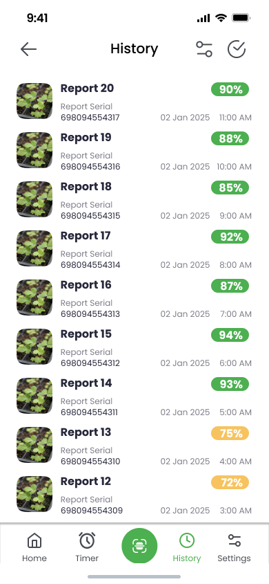

# 🌱 Agri Lens – Smart Farming System

**Mansoura University – Faculty of Computers and Information**  
**Graduation Project – Computer Science Department**

Agri Lens is a smart farming system that leverages embedded systems and AI to improve crop monitoring, automate irrigation, and detect plant diseases—focusing particularly on strawberry plants. This project reflects our commitment to supporting sustainable agriculture using modern technology.

---

## 📚 Table of Contents
- [👥 Contributors](#-contributors)
- [📖 Project Overview](#-project-overview)
- [🎯 Project Goals](#-project-goals)
- [🛠️ System Architecture](#️-system-architecture)
- [⚙️ How It Works](#️-how-it-works)
- [🧠 AI Based Disease Detection](#ai-based-disease-detection)
- [📱 Flutter Application Implementation](#-flutter-application-implementation)
- [🌐 Frontend Introduction Page](#-frontend-introduction-page)
- [📦 Backend Architecture Overview](#-backend-architecture-overview)
- [🧰 Technologies Used](#-technologies-used)
- [🌟 Key Features](#-key-features)
- [🧠 Challenges & Solutions](#-challenges--solutions)
- [🙌 Acknowledgments](#-acknowledgments)
- [🔮 Future Work](#-future-work)
- [🖼️ Gallery](#️-gallery)

---

## 👥 Contributors

This project was developed by the **Agri Lens Team**, composed of 10 dedicated students from the Computer Science Department at Mansoura University.

#### Team Members
* [Ibrahim Hegazi](https://www.linkedin.com/in/ibrahim-hegazi/) **[Team Leader and AI Engineer]**

* [Ibrahim Al Banawy](https://www.linkedin.com/in/ibrahim-al-banawy/) **[Front End Developer and Hardware Expert]**

* [Basel Elazaly](https://www.linkedin.com/in/basel-elazaly-02b132220/) **[Flutter Developer]**

* [Abdelaleem Mohamed](https://www.linkedin.com/in/abdelaleem-mohammed-914586223/) **[Business Analyst]**

* [Ahmed Khalaf](https://www.linkedin.com/in/a-cr7-701b56268/) **[AI Engineer]**

* [Zeyad Emad](https://www.linkedin.com/in/zeyademad/) **[Front End Developer]**

* [Ahmed Zain](https://www.linkedin.com/in/ahmed-zain-738706315/) **[Back End Developer]**

* [Ibrahim Saber](https://www.linkedin.com/in/ibrahim-saber-549723267/) **[Back End Developer]**

* [Ahmed Ashraf](https://www.linkedin.com/in/ahmed-ashraf-630896309/) **[Flutter Developer]**

* [Mohamed Tharwat](https://www.linkedin.com/in/mohamed-tharwat-5bbb05203/) **[UI/UX Designer]**

#### Special Thanks
* [Sohil Abuzeid](https://www.linkedin.com/in/sohil-abuzeid-b8001a239/) **[External Back End Consultant]**
* [Moataz Arafa](https://www.linkedin.com/in/moataz-arafa-1ba0b2373/) **[External Hardware Consultant]**

---

## 📖 Project Overview

Agri Lens is a smart farming prototype designed to assist farmers in managing crops more efficiently using automation and computer vision. By automating irrigation and leveraging AI for plant disease detection—especially for strawberry plants—Agri Lens helps reduce manual effort, conserve water, and prevent disease outbreaks at early stages.

---

## 🎯 Project Goals

- Enable early detection of plant diseases through AI-based image analysis  
- Automate irrigation based on real-time soil and weather conditions  
- Build a cost-effective, modular solution accessible to small and medium-scale farmers  
- Improve crop yield and resource efficiency using embedded systems and smart control logic

---

## 🛠️ System Architecture

The system consists of two main circuits and a structured control box built from wood with three planting cells:

#### 📷 Circuit 1 – Image Capture Module
- ESP32-CAM for capturing images  
- Stepper Motor mounted on a metal rod for horizontal camera movement  
- Motor Driver (e.g., ULN2003) to control motor  
- Sends plant images to the backend for AI analysis  

#### 💧 Circuit 2 – Irrigation & Environmental Monitoring Module
- ESP32 Microcontroller  
- 3 × Soil Moisture Sensors (one per cell)  
- 3 × Water Pumps (one per cell)  
- DHT11 Sensor (placed outside the box)  
- Motor Driver for pump control  
- Automates irrigation based on soil data and environmental readings  

---

## ⚙️ How It Works

#### Sensor Data Collection
- Soil moisture sensors monitor water levels in each cell  
- DHT11 measures temperature and humidity  

#### Automated Irrigation
- Water pumps activate individually based on real-time moisture levels  
- Controlled through ESP32 logic with thresholds  

#### Plant Image Capture
- The ESP32-CAM is mounted on a motorized rail  
- Moves across all cells to capture top-view images of each plant  

#### AI-Based Disease Detection
- Captured images are sent to an AI model  
- Focused on detecting strawberry leaf diseases  
- Prediction results are stored in the backend  

#### Control Dashboard (Future Integration)
- Users can monitor readings and receive alerts via a mobile/web interface  

---

## 🧠 AI Based Disease Detection

To enable early and precise detection of strawberry plant diseases, we developed a custom AI pipeline using **YOLOv11** with **instance segmentation**. This model provides pixel-level disease localization, enabling timely and targeted interventions.

---

#### 🔍 Why YOLOv11?

- **High Accuracy** in identifying diseased regions  
- **Instance Segmentation** for detailed mask-level predictions  
- **Early Detection** of symptoms at initial growth stages  

**Performance on our custom dataset:**

- 🎯 **Box mAP@50**: 76.6%  
- 🎯 **Mask mAP@50**: 76.8%  
- ✅ *Outperforms YOLOv8 in all evaluated metrics*

---

#### 🧪 AI Pipeline Overview

##### 📌 1. Requirement Analysis & Data Preparation

- **Diseases Targeted**: *Powdery Mildew*, *Gray Mold*, *Anthracnose*, etc.  
- **Data**: Healthy and diseased leaf images collected from open datasets and web scraping (via FastAI)  
- **Annotation**: Pixel-wise masks labeled in YOLO format using **Roboflow**  
- **Augmentation**: Flipping, rotation, shifting, and scaling to diversify samples  

---

##### 📌 2. Model Selection

- **Architectures Compared**:
  - **YOLOv8-seg**: 151 layers, 3.4M parameters  
  - **YOLOv11-seg**: 253 layers, 22M parameters  

✅ **Final Choice**: YOLOv11-seg, offering better detection and segmentation quality.

---

##### 📌 3. Training & Hyperparameter Tuning

- **Optimizer**: SGD with momentum (0.937)  
- **Learning Rate**: 0.01  
- **Dropout**: 0.0  
- **Patience**: 100 epochs  

Trained to detect and segment individual leaves with high precision.

---

##### 📌 4. Evaluation Summary

| Metric         | YOLOv8 | YOLOv11 |
|----------------|--------|---------|
| Box Precision  | 0.902  | 0.953   |
| Box mAP@50     | 0.703  | 0.766   |
| Mask mAP@50    | 0.703  | 0.768   |
| Mask mAP@50-95 | 0.569  | 0.657   |

✅ **Conclusion**: YOLOv11 achieved consistently better results across all detection and segmentation metrics.

---

##### 📌 5. Deployment

- **Backend**: Deployed via **FastAPI**  
- **Flow**:  
  ESP32-CAM → FastAPI API → YOLOv11 Model → Predictions stored in Firebase  
- **Upcoming**: Flutter-based dashboard for real-time health monitoring and alerts

---

## 📱 Flutter Application Implementation

#### Planning and Requirement Analysis

**Objective:**  
Define scope and core functionalities of the Agri Lens app for monitoring plant health via sensors and a movable camera.

**Key Features Identified:**
- **User Authentication:** Splash screen, onboarding, login, Google sign-in, change password.
- **Monitoring Dashboard:** Plant cells with health %, room temp & humidity, cell-specific details with image and data.
- **Search & Camera Control:** Search by cell, schedule camera intervals, and manual image capture for ML-based analysis.
- **Reports & Notifications:** Daily health reports with charts, enable/disable alerts.
- **Profile & Settings:** Edit profile, app info, feedback, rating options.

---

#### UI/UX Design

**Objective:**  
Create a clean, user-friendly interface optimized for mobile.

**Highlights:**
- Consistent color scheme and iconography.
- Bottom navigation bar (Home, Timer, Camera, Reports, Settings).
- Data visualized through cards, images, and animated charts.
- Scalable UI elements for accessibility.

---

#### Development

**Objective:**  
Build the app using Flutter, integrating with Firebase and an API for real-time data and health diagnostics.

**Technologies Used:**
- **State Management:** Cubit (Flutter Bloc) architecture to separate UI and business logic.
- **Backends:**
  - **Firebase:** Auth, sensor data, camera settings, notifications.
  - **REST API (Dio):** Upload images, receive health analysis and daily reports.
- **Local Storage:** SharedPreferences for tokens, camera settings, user preferences.

---

#### Asynchronous Operations

**Handled Via:**
- `async/await` for non-blocking API calls and Firebase operations.
- `Future.delayed` for UI transitions (e.g., splash screen).
- Loading indicators shown during login, uploads, and data fetches.

---

#### Libraries Used

- **Firebase Core/Auth/Firestore/Storage** – Backend services and real-time data.
- **flutter_bloc / bloc** – Cubit-based state management.
- **Dio** – REST API integration.
- **SharedPreferences** – Lightweight local storage.
- **Image Picker / Camera** – Manual photo capture.
- **Datetime Picker** – Camera interval settings.
- **Cached Network Image** – Efficient image display.
- **FL Chart** – Trend visualization.

---

### 🌐 Frontend Introduction Page

The frontend component of *Agri Lens* includes a simple and informative **React-based introduction page** that presents an overview of the system, highlights its features, and provides an entry point for users and stakeholders to explore the project.

This frontend was also showcased during our participation in the **Hult Prize competition**, helping us present the concept and technical design of our smart farming system to judges and attendees in a clear and engaging manner.

#### 🔗 Project Link

You can view the frontend project here: [Agri Lens Frontend](https://ibrahimalbanawy.github.io/agri-lens/)

---

### 📦 Backend Architecture Overview

The vertical farming backend is built with ASP.NET Core and SQL Server, designed to support automation, monitoring, and data analysis for smart farming. The system manages farms, crops, users, sensors, alerts, and AI analysis in a scalable and modular manner.

---

#### 🏗️ System Design

- **Architecture Pattern**: MVC (Model-View-Controller)
- **ORM**: Entity Framework Core (Code-First)
- **API**: RESTful with Swagger documentation
- **Core Layers**: Controllers, Services, Models, Data Access

---

#### 🔧 Core Modules

- **Crop Controller**: Handles CRUD for crop entities.
- **Farm Controller**: Manages farm registration and links with users/crops.
- **Sensor Controller**: Registers sensors and handles real-time data uploads.
- **Disease Alert Controller**: Monitors and alerts on disease risks using sensor thresholds and AI.
- **User Controller**: Manages roles (Admin, Farmer, Analyst), authentication, and farm-user assignments.
- **AI Module**: Analyzes sensor data for predictive alerts.
- **Database**: Normalized SQL Server schema with relations and EF migrations.
- **Validation**: Built-in with annotations and global exception handling.

---

#### 📊 Monitoring & Documentation

- Real-time readiness via SignalR
- Logging with Serilog
- Swagger UI for API usage and testing

---

#### 🚀 Benefits

- Modular, maintainable, and scalable
- Secure endpoints
- Extensible for AI/ML, weather APIs, and advanced dashboards

---

#### 🔮 Future Plans

- Integrate ML.NET for crop predictions
- Add weather API for smarter decisions
- Use GraphQL for flexible queries
- Enhance dashboard UI with analytics

## 🧰 Technologies Used

- **Embedded Systems:** ESP32-CAM, ESP32 Microcontroller  
- **Sensors:** DHT11, Soil Moisture Sensors  
- **Actuators:** Stepper Motor, Mini Water Pumps  
- **AI:** Image Classification Model for Disease Detection  
- **Cloud Services:** Firebase Realtime Database, Supabase (for image storage)  
- **Programming Languages:** C++ (Arduino), Python (AI model), JavaScript (frontend)  
- **Mobile/Web App:** Flutter (planned), React (dashboard design prototype)  

---

## 🌟 Key Features

- Modular farming box with 3 isolated plant environments  
- Automated irrigation using soil condition feedback  
- Mobile ESP32-CAM for image-based plant health monitoring  
- AI-based early disease detection, optimized for strawberries  
- Scalable design for larger farm environments  

---

## 🧠 Challenges & Solutions

| **Challenge**                              | **Solution**                                              |
|-------------------------------------------|-----------------------------------------------------------|
| Integrating multiple ESP32 modules        | Unified communication through Firebase                   |
| Synchronizing motor and camera movement   | Used delay and step-count logic for accurate positioning |
| Disease image dataset limitations         | Focused on strawberry dataset and augmented data         |
| Real-time updates to the mobile app       | Firebase used for seamless data syncing                  |

---

## 🙌 Acknowledgments

We are deeply thankful for the guidance and support provided by our supervisors, faculty members, and external collaborators. Special appreciation to:

- **Faculty of Computers and Information – Mansoura University**  
- **Our hardware consultant** for support in mechanical system design  
- **Our backend consultant** for Firebase and cloud integration  
- **All team members** for their dedication and collaboration throughout this journey  

---

## 🔮 Future Work

- Expand AI model to detect multiple plant diseases  
- Introduce hydroponic irrigation system  
- Develop a complete Flutter-based control app  
- Integrate reinforcement learning for dynamic irrigation control  
- Improve sensor calibration and error handling mechanisms  

---

## 🖼️ Gallery

> 📸 A look into the system — from AI predictions to mobile app views and hardware setup.

---

### 📱 Mobile App Screenshots

<table>
  <tr>
    <td align="center"></td>
    <td align="center"></td>
    <td align="center"></td>
    <td align="center"></td>
  </tr>
  <tr>
    <td align="center"></td>
    <td align="center"></td>
    <td align="center"></td>
    <td align="center"></td>
  </tr>
</table>

---

### 🛠️ Hardware Images

### 🛠️ Hardware Images

<table>
  <tr>
    <td align="center"></td>
    <td align="center"></td>
    <td align="center"></td>
    <td align="center"></td>
  </tr>
  <tr>
    <td align="center"></td>
    <td align="center"></td>
    <td align="center"></td>
    <td align="center"></td>
  </tr>
</table>

---

### 🎥 Demo Videos

#### 🔧 Hardware Demo
📹 [Watch the hardware demo](./AgriLens%20Documentations%20and%20Presentations/Media/Hardware%20Demo.mp4)

#### 📱 Flutter App Demo
📹 [Watch the Flutter app demo](./AgriLens%20Documentations%20and%20Presentations/Media/Flutter%20Demo.mp4)

---

### 🎥 Demo Videos

<table>
  <tr>
    <td width="50%" align="center">
      <h3>🔧 Hardware Demo</h3>
      <a href="./AgriLens%20Documentations%20and%20Presentations/Media/Hardware%20Demo.mp4">
        
         
        <strong>▶️ Watch Demo</strong>
      </a>
      
See our hardware components in action

    </td>
    <td width="50%" align="center">
      <h3>📱 Flutter App Demo</h3>
      <a href="./AgriLens%20Documentations%20and%20Presentations/Media/Flutter%20Demo.mp4">
        
         
        <strong>▶️ Watch Demo</strong>
      </a>
      
Explore the mobile application features

    </td>
  </tr>
</table>

---

### 🎥 Demo Videos

<table>
  <tr>
    <td width="50%">
      <h3 align="center">🔧 Hardware Demo</h3>
      
      
<a href="./Media/Hardware_Demo.mp4"><strong>▶️ Watch Full Video</strong></a>

    </td>
    <td width="50%">
      <h3 align="center">📱 Flutter App Demo</h3>
      
      
<a href="./Media/Flutter_Demo.mp4"><strong>▶️ Watch Full Video</strong></a>

    </td>
  </tr>
</table>

